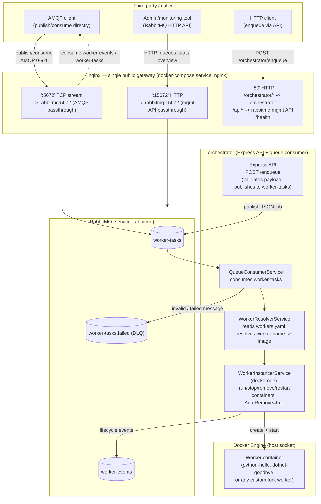

# worker-orchestrator

A queue-driven orchestrator that turns HTTP (or direct AMQP) requests into short-lived Docker containers ("workers") and tears them down automatically once they exit. **Note:** "tears down" is not the same as "waits for completion" — see [Known limitation: no completion ACK](#known-limitation-no-completion-ack) below.

**This repository is meant to be forked.** The core pieces — the Express API, the RabbitMQ queue, the orchestration logic, and the nginx gateway — are generic and reusable. What's specific to *your* use case is the set of **workers**: the actual Docker images that do the work. Each fork is expected to:

- Add its own worker Dockerfiles under `workers/<worker-name>/`.
- Register them in its own `workers/workers.yaml` (copied from the committed [`workers/workers.template.yaml`](workers/workers.template.yaml), the same way `.env` is copied from `.env.example`).

`.gitignore` enforces this split: everything under `workers/` is ignored except `workers.template.yaml` — so a fork's real worker images and worker registry never pollute the base repo, and the base repo stays a clean template. The `python-hello` and `dotnet-goodbye` workers you may see locally are just examples showing the pattern in two different language stacks; they are not part of the committed base.

## How the parts fit together



**Responsibilities:**

| Part | Responsibility |
|---|---|
| **nginx** (`nginx/`) | The only service with published host ports. Fronts everything: HTTP on `:80` (path-based routing to the orchestrator and to RabbitMQ's management API), plus two direct passthroughs added for third parties — TCP `stream` proxy on `:5672` for raw AMQP, and an HTTP passthrough on `:15672` for RabbitMQ's management API at its natural root paths. |
| **orchestrator** (`orchestrator/`) | A single Node/TypeScript process with two jobs: (1) an Express API that validates and publishes enqueue requests (`src/api/`), and (2) a RabbitMQ consumer (`src/services/queueConsumer.service.ts`) that resolves the requested worker (`workerResolver.service.ts`, backed by `workers.yaml`) and drives its Docker lifecycle via `dockerode` (`workerInstancer.service.ts`). Invalid/failed messages are nacked to the `worker-tasks.failed` dead-letter queue; lifecycle events are published to `worker-events` — but only for `start`/`stop`/`remove`/`restart`, **not for job completion** (see caveat below). |
| **queue** (`queue/`) | The RabbitMQ broker itself. Users, permissions, vhost, and the three durable queues are declared in `definitions.json.template` and materialized at container boot by `entrypoint.sh` (which hashes the passwords for the `admin` user and the restricted `api-operator` user used for third-party access). |
| **workers** (`workers/`) | The pluggable, fork-specific part. Each subfolder is a self-contained Dockerfile that does one job, reads its input from environment variables (job `metadata` is uppercased into env vars by the orchestrator), and exits. The orchestrator runs these as `AutoRemove: true` containers — they clean up after themselves. |
| **test** (`test/`) | Local smoke-testing scripts. Not committed by default (gitignored) — each fork adds its own. |

## How a third party calls the queue

There are two supported entry points, both fronted by nginx — a third party never talks to the `rabbitmq` or `orchestrator` containers directly, only through the published nginx ports:

1. **Through the orchestrator's HTTP API (recommended)** — `POST http://<host>/orchestrator/enqueue` with a JSON body:
   ```json
   { "worker": "python-hello-worker", "action": "run", "metadata": { "foo": "bar" } }
   ```
   This goes through validation (`zod`), gets a `202` immediately, and is published onto `worker-tasks` for the orchestrator's consumer to act on. This is the only path that guarantees the orchestrator's own request shape is enforced.

2. **Directly against RabbitMQ (for third-party systems/integrators)** — nginx also exposes RabbitMQ itself:
   - **AMQP `:5672`** — connect with any AMQP 0-9-1 client (e.g. `amqplib`, `pika`) using the dedicated `RABBITMQ_API_USER`/`RABBITMQ_API_PASS` credentials, and publish/consume directly on `worker-tasks` / `worker-events`. Messages published this way are picked up by the same orchestrator consumer as API-originated ones.
   - **Management HTTP API `:15672`** (or `:80/api/...`) — for reading queue stats, publishing via the HTTP API, or general observability, using the same credentials.

   The `api-operator` user is deliberately scoped to **read/write messages only** (`configure: ""` in `definitions.json.template`) — it cannot declare/delete queues, exchanges, users, or vhosts. Only the `admin` user (used internally by the orchestrator) has full control.

## Known limitation: no completion ACK

`worker-tasks` messages are ACKed as soon as the requested Docker action **is issued successfully**, not when the worker container actually finishes its job. Concretely, in `workerInstancer.service.ts`'s `run()`:

```
createContainer → container.start() → publish "started" event → return
```

`queueConsumer.service.ts` calls `channel.ack(msg)` right after that `await` resolves — i.e. the moment the container is *launched*. There is no `container.wait()`, no Docker events listener, and no exit-code handling anywhere in the codebase. Combined with `AutoRemove: true` on every worker container, this means:

- A worker that starts successfully but then crashes, hangs, or fails its actual job looks identical to one that succeeded — from the orchestrator's point of view, both were just "started".
- `WorkerStatus` (`models/queues.model.ts`) only has `started | stopped | removed | restarted` — there's no `completed`/`failed` state.
- Once a worker container exits, it's auto-removed, so `docker logs` on it is only useful if you catch it before that happens.
- The `worker-tasks.failed` DLQ only catches failures in *message handling* (bad JSON, unknown worker, a Docker API call itself throwing) — never a worker's own job failure.

If you need real completion tracking in your fork, the natural extension point is `workerInstancer.service.ts`'s `run()`: `await container.wait()` (or subscribe to `docker.getEvents()` filtered by container ID) without blocking the queue ack, and publish a `completed`/`failed` event with the exit code to `worker-events` when it resolves.

## Local build & test

**Prerequisites:** Docker + Docker Compose.

```bash
# 1. Copy env templates and fill in real secrets
cp .env.example .env

# 2. (Fork-specific) copy the workers template and register your workers
cp workers/workers.template.yaml workers/workers.yaml
# then add a Dockerfile per worker under workers/<name>/ and list it in workers.yaml

# 3. Build worker images referenced by workers.yaml (they don't run as services —
#    they're built under the "workers" compose profile so dockerode can spin
#    them up on demand later)
docker compose --profile workers build

# 4. Start the core stack: rabbitmq, orchestrator, nginx
docker compose up --build
```

Once running:
- `curl http://localhost/health` — nginx health check.
- `curl -X POST http://localhost/orchestrator/enqueue -H 'Content-Type: application/json' -d '{"worker":"python-hello-worker","action":"run","metadata":{}}'` — enqueue a job.
- `docker ps -a` — see the worker container spin up and auto-remove.
- `docker compose logs -f orchestrator` — follow orchestration + queue consumer logs.

Run the end-to-end smoke test (enqueues a sequence of jobs through the API, and separately verifies direct third-party access to RabbitMQ over both AMQP and the management API):

```bash
bash test/test-workers.sh
```

To rebuild the orchestrator (TypeScript) locally without Docker: `cd orchestrator && npm install && npm run build`.

## Folder structure

```
.
├── docker-compose.yaml       # Wires rabbitmq, orchestrator, nginx, and worker images together
├── .env / .env.example       # Shared config: RabbitMQ credentials/ports, workers config path
├── nginx/                    # Public gateway: HTTP routing (:80) + AMQP/mgmt-API passthroughs
│   ├── Dockerfile
│   ├── nginx.conf            #   top-level config (adds the AMQP `stream {}` block)
│   └── default.conf          #   HTTP server blocks (:80 routing, :15672 passthrough)
├── queue/                    # RabbitMQ broker image: users, permissions, queues
│   ├── Dockerfile
│   ├── definitions.json.template
│   ├── entrypoint.sh         #   hashes passwords, renders definitions.json at boot
│   └── rabbitmq.conf
├── orchestrator/             # The Express API + RabbitMQ consumer (TypeScript/Node)
│   ├── Dockerfile
│   └── src/
│       ├── api/               # Express server + /enqueue route
│       ├── services/          # queuePublisher, queueConsumer, workerResolver, workerInstancer, logger
│       ├── models/             # Queue names, worker actions/status enums
│       ├── types/              # zod schemas for queue messages
│       └── errors/             # Domain-specific error classes
├── workers/                  # Fork-specific: one subfolder per worker Docker image
│   ├── workers.template.yaml #   the only committed file here — copy to workers.yaml per fork
│   └── <worker-name>/        #   e.g. a Dockerfile + entrypoint per worker (gitignored)
└── test/                     # Local smoke-test scripts (gitignored; add your own per fork)
    └── test-workers.sh
```
